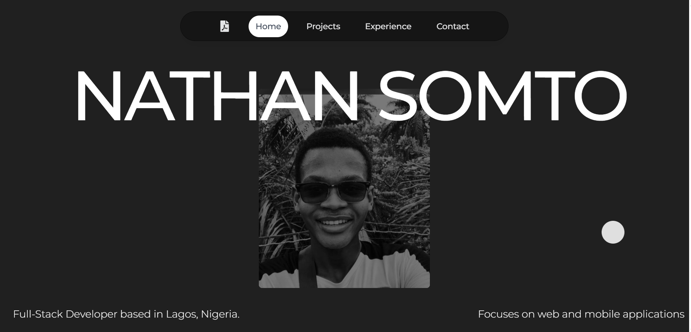

# Portfolio Website

Welcome to my portfolio website! 🚀 My name is **Somtochi Mkparu**, but most people call me Nathan Somto. I’m a Full-Stack Developer based in Lagos, Nigeria, I enjoy building web and mobile applications, solving problems, and learning new things.

## Tech Stack

This portfolio was built using the following technologies:

- **React**: for the user interface.
- **Framer Motion**: for animations, transitions and scroll effects.
- **EmailJS**: For handling email submissions from the contact form.
- **React-Hot-Toast**: To display notifications.
- **TailwindCSS**: For styling the site using a utility first approach.
- **Blobity**: for custom blob cursor
- **Lenis**: for smooth scroll

## Sneak Peek


[check it out](https://somtochi-dev.vercel.app)

## Installation

To run this portfolio locally, follow these steps:

1. Clone the repository:

   ```bash
   git clone https://github.com/Nathan-Somto/portfolio-v1.git
   cd portfolio-website
   ```

2. Install dependencies:

   ```bash
   npm install
   ```

3. Start the development server:

   ```bash
   npm start
   ```

4. Open your browser and navigate to `http://localhost:3000`.

## Setting Up EmailJS

To enable the contact form functionality:

1. Create an [EmailJS](https://emailjs.com) account.
2. Set up a service and email template in your EmailJS dashboard.
3. Replace the placeholders in the code with your EmailJS credentials:
   - `YOUR_SERVICE_ID`
   - `YOUR_TEMPLATE_ID`
   - `YOUR_PUBLIC_KEY`
4. Ensure the fields in the EmailJS template match the `name` attributes in the form (`name`, `email`, and `message`).

## Note

If you intend to use this portfolio as a template for your own, I would appreciate it if you credit me as your inspiration. 😊

Feel free to reach out to me if you have any questions or need assistance setting things up.

Thanks for checking out my portfolio!  
please leave a :star:
